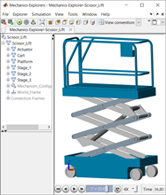

# **Scissor Lift Model in Simscape Multibody**
Copyright 2012-2023 The MathWorks(TM), Inc.

This file contains a scissor lift model with hydraulic actuation built using
Simscape Multibody and Simscape Fluids. The scissor lift model is assembled
from a library of parameterized component models. Intermediate models are 
included to show you the steps of modeling this system. A MATLAB UI is also
included that allows you to interactively change the dimensions of the scissor lift.  

View on File Exchange:   
You can also open in MATLAB Online:  

Open the project file Scissor_Lift.prj to begin.

This sets up the path and opens a web page with links to models and documentation.
Hyperlinks in the models guide you to options in the model that you can explore.
The contact modeling with the floor currently uses Contact_Forces_Core.prj
as a Reference Project, but could use the Spatial Contact Force block 
added in R2019b.

## **Main Model**

## **Mechanical Model**

## **Hydraulic Model**

Key parts of this submission:
1. The model of the complete scissor lift with variants for actuation and testing
   is in the root directory sm_scissor_lift_testenv.slx

2. The parameterized components used to build the scissor lift
   are in the file sm_scissor_lift_lib.slx in subdirectory "Libraries".
   This includes a crossbar assembly that can be used for the left or right side
   of the lift by changing a dialog box parameter.

3. Subdirectory Submodels/01_Defining Bodies contains incremental steps for
   building the scissor lift.

4. Subdirectory Submodels/02_Hydraulic_Act contains a standalone model of a
   hydraulic actuation architecture similar to what is used in the main model.

5. MATLAB scripts for defining extrusions are in subddirectory Scripts_Data.
   (Extr_Data_Box.m, etc.)

